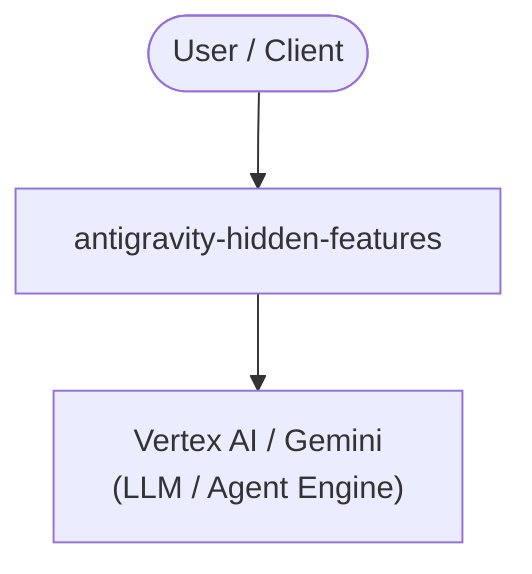

# YouTube Video Production Package
# "8 Hidden Google Antigravity Features Nobody Talked About"

## 📊 Gap Analysis

After analyzing transcripts from 20 top Antigravity YouTube videos, we identified **15 topics** that are NOT covered by any existing video. This video fills the **8 most important gaps**.

### Topics COVERED in existing videos:
1. Basic intro / what is Antigravity
2. Antigravity 2.0 desktop app tour
3. Agent Manager GUI
4. Browser tool (autonomous testing/debugging)
5. Agent Inbox (parallel agents)
6. Building a simple app (todo list)
7. CLI installation basics (npm install)
8. CLI basic slash commands (/config)
9. 2.0 vs CLI vs IDE vs SDK surface comparison
10. Antigravity vs Claude Code comparisons
11. Agentic workflows vs automations
12. Skills Kit (using 1239+ existing skills)
13. WSL terminal integration
14. I/O 2026 keynote demo
15. SDLC automation overview
16. Opencode integration

### Topics MISSING (the gaps this video covers):
1. **Antigravity SDK** — building custom agents programmatically
2. **Custom Skill Creation** — writing your own skills (not just using existing)
3. **Scheduled Tasks** — cron jobs, running agents on a schedule
4. **MCP Integration** — Model Context Protocol for connecting external tools
5. **Enterprise Features** — team collaboration, shared workspaces, admin controls
6. **Git Workflow** — PRs, commits, branching within Antigravity
7. **Security & Sandboxing** — safe execution, permissions, data privacy
8. **Production Deployment** — CI/CD pipelines, Docker, cloud deploy from CLI

### Additional gaps not covered in this video (future videos):
9. Database & backend integration
10. Pricing & plans (free tier limits, paid features)
11. Gemini 3.6 Flash (latest model, July 2026)
12. Multi-agent orchestration patterns (advanced)
13. Debugging & error handling (when agents fail)
14. Custom model configuration (Ollama, vLLM, local models)
15. Migration guide (from Claude Code/Cursor)

---

## 🎬 Video Script

### Title Options
1. "8 Hidden Google Antigravity Features Nobody Talked About"
2. "You're Using Antigravity Wrong: 8 Features You're Missing"
3. "Antigravity Has a DARK MODE Nobody Showed You (8 Hidden Features)"
4. "The Antigravity Features Google Didn't Show You"
5. "8 Antigravity Features That Will Change How You Code Forever"

### Suggested Title (SEO-optimized):
**"8 Hidden Google Antigravity Features Nobody Talked About"**

### Video Description
```
Google Antigravity is packed with features, but most YouTube tutorials only cover the basics. After watching 20+ Antigravity videos, I found 8 critical features that NOBODY is talking about. In this video, we dive deep into:

1. Antigravity SDK — Build custom agents programmatically
2. Custom Skill Creation — Write your own Agent Skills
3. Scheduled Tasks — Run agents on autopilot with cron jobs
4. MCP Integration — Connect external tools via Model Context Protocol
5. Enterprise Features — Team collaboration and admin controls
6. Git Workflow — PRs, commits, and branching inside Antigravity
7. Security & Sandboxing — Safe execution and permissions
8. Production Deployment — Ship from CLI with CI/CD pipelines

These are the features that separate beginners from power users. Whether you're using Antigravity CLI, IDE, or 2.0, these hidden gems will transform your workflow.

Timestamps:
0:00 - Introduction
1:30 - Feature #1: Antigravity SDK
4:00 - Feature #2: Custom Skill Creation
6:30 - Feature #3: Scheduled Tasks
9:00 - Feature #4: MCP Integration
11:30 - Feature #5: Enterprise Features
14:00 - Feature #6: Git Workflow Integration
16:30 - Feature #7: Security & Sandboxing
19:00 - Feature #8: Production Deployment
21:30 - Summary & Call to Action
```

### Tags
```
Google Antigravity, Antigravity CLI, Antigravity SDK, MCP, custom skills, scheduled tasks, 
enterprise, git integration, security, production deployment, agentic AI, AI coding, 
Google AI, Gemini, developer tools, coding agent, AI agent, vibe coding
```

---

## 🖼️ Thumbnail

Generated with AADDYY Image Generator (fal.ai imagen4/preview)
File: `thumbnail.png`
Prompt: "YouTube thumbnail for a tech video about 8 hidden Google Antigravity features. Dark futuristic background with glowing blue and purple elements. Show icons representing SDK, custom skills, scheduled tasks, MCP, enterprise, git, security, and deployment. Bold text '8 HIDDEN FEATURES' in white with yellow accent."

---

## 📝 Full Article/Script

See `script.md` for the full article generated by AADDYY Article Generator.

---

## 💰 Production Costs (AADDYY)

| Item | Tool | Credits | Cost |
|------|------|---------|------|
| SEO Titles | Title Generator | 1 | $0.01 |
| Article/Script | Article Generator | 5 | $0.05 |
| Thumbnail | Image Generator | 8 | $0.08 |
| SEO Keywords | Keyword Researcher | 5 | $0.05 |
| **Video Generation** | Edu Clip Generator | ~60 | $0.60 |
| **Total** | | **~79** | **~$0.79** |

### Credits Used
- Started with: $0.49 remaining
- Used: $0.09 (title + article + thumbnail)
- Remaining: $0.35
- **Need $0.44 more for video generation** — top up at https://www.aaddyy.com/dashboard

---

## 🚀 Next Steps

1. **Top up AADDYY credits** ($5 = 500 credits, enough for 7+ videos)
2. **Generate the video** using `aaddyy_edu_clip_generator` or `aaddyy_seedance_video_generator`
3. **Upload to YouTube** with the title, description, tags, and thumbnail above
4. **Add to the Antigravity playlist** at github.com/avnit/antigravity-playlist

---

Generated by Hermes Agent using AADDYY AI Tools + YouTube Data API v3
August 2026

<!-- ARCH-DIAGRAM:START -->

## Architecture

> Auto-generated architecture diagram. See [`docs/context-map.md`](docs/context-map.md) for the full context map (core application, containers/cloud, and database connections).



<!-- ARCH-DIAGRAM:END -->
